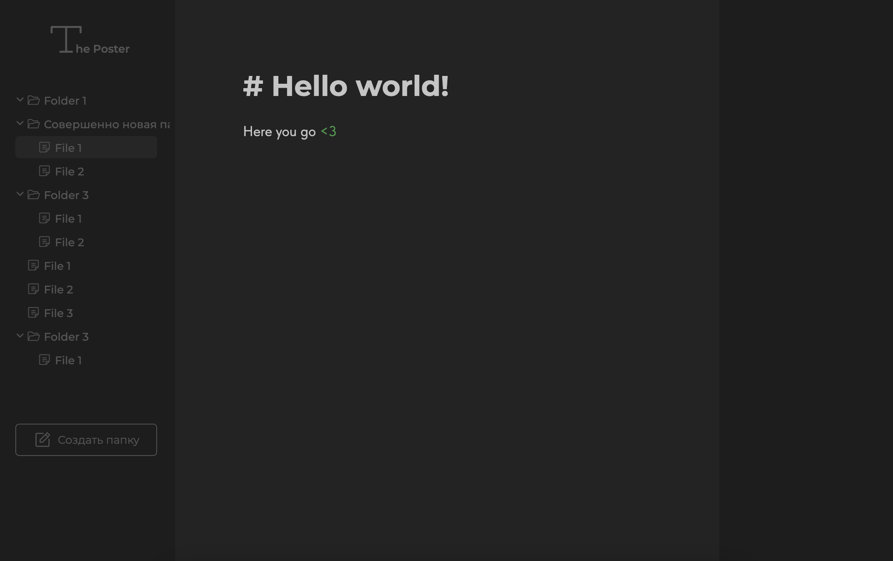
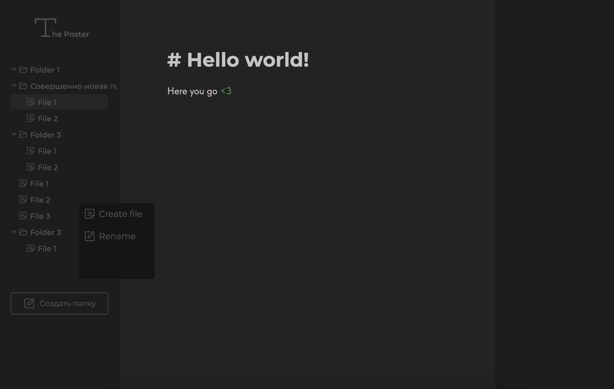
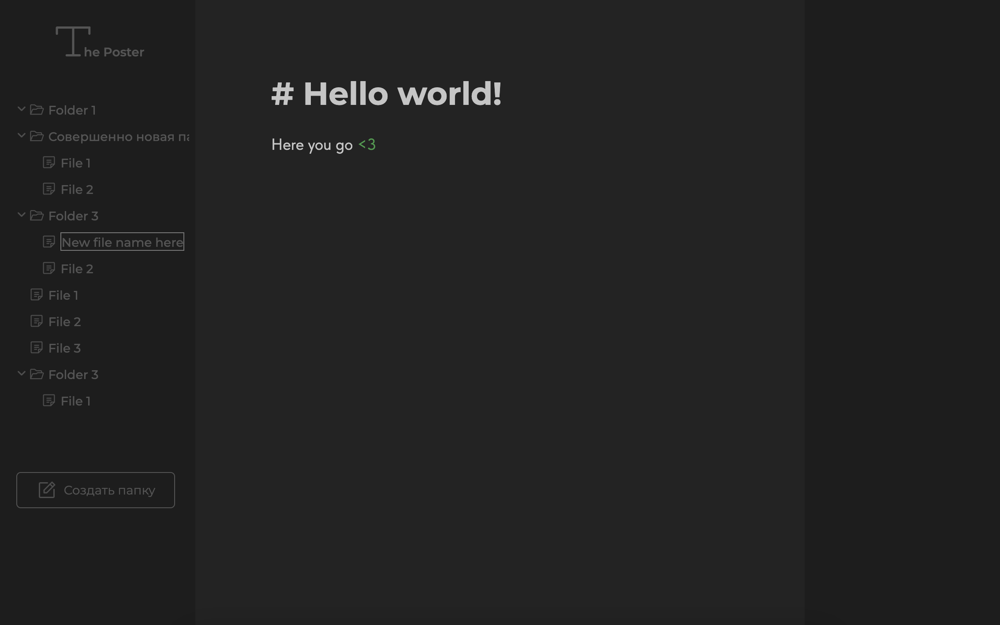

# The Poster

This is my portfolio project to show my front-end skills. *The Poster* is the platform where you can store your notes.

Implemented all the intended functionality, except for the creation of folders.
- You can rename a file or a folder
- You can browse and edit a file with markdown
- You can hide the contents of folders and expose them
- File creation and renaming context menu
- API-first implementation

Online preview: https://wemmbley.github.io/the-poster/

## Screenshot

## Context menu

## Inline renaming

Press escape or enter for canceling or saving.